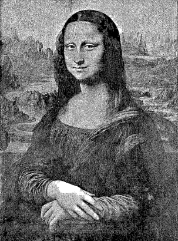
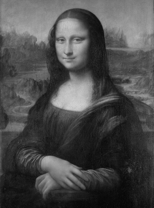
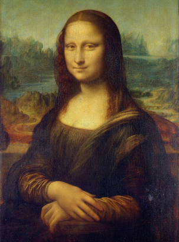

# [MFBpdf](https://github.com/ImageProcessing-ElectronicPublications/mfbpdf) demo.

**MFBpdf** is a simple project for easy converting PNM to (MASK+FG+BG)-pdf.
It uses [libtiff](https://github.com/vadz/libtiff) and [libjpeg](https://github.com/LuaDist/libjpeg) for all technichal work and compression.
The breakdown of the image into components is done using [DjVuL](https://github.com/plzombie/depress/issues/2) and [DjVuL wiki](https://sourceforge.net/p/imthreshold/wiki/DjVuL/?version=3).

## demo



```shell
mfbpdf mona.pbm mona.pbm.tif mona.pbm.pdf

  1556493 mona.pbm
   901098 mona.pbm.pdf
   899894 mona.pbm.tif
```



```shell
mfbpdf mona.pgm mona.pgm.tif mona.pgm.pdf

 12435473 mona.pgm
  1081965 mona.pgm.pdf
   881104 mona.pgm.tif
```



```shell
mfbpdf mona.ppm mona.ppm.tif mona.ppm.pdf

 37306385 mona.ppm
  1125738 mona.ppm.pdf
   900450 mona.ppm.tif
```
